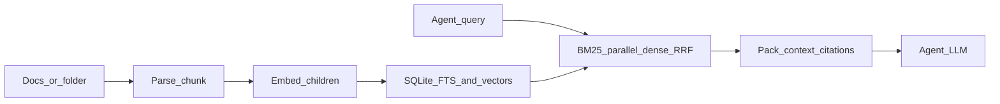

# custom-rag (CRAG)

[](https://github.com/MAHIR-BABBAR/CRAG/actions/workflows/ci.yml)

A local retrieval service for agents: parse documents, chunk them into parent/child
pairs, embed the children, store everything in SQLite, and answer queries with
hybrid BM25 + dense search fused by Reciprocal Rank Fusion. The result is a packed
context block with citations, sized to a character budget.

There is no LLM generation inside the library. CRAG returns evidence; the calling
agent owns the prompt and the answer.



## Install

```bash
pip install -e ".[dev,ingestion,embeddings,storage]"
# Optional: SciFact evaluation and the vectorized dense backend
pip install -e ".[eval,numpy]"
```

## Quickstart

```bash
# Index a file or a directory; hybrid is the default retrieval mode
crag index ./demo_corpus --provider mock
crag query "What is hybrid retrieval?" --provider mock --json
crag context "What is hybrid retrieval?" --provider mock --json
crag serve --host 127.0.0.1 --port 8000
```

The HTTP surface is `GET /v1/health`, `POST /v1/index` (file or directory),
`POST /v1/retrieve`, and `POST /v1/context`.

### Docker

```bash
docker compose up --build
python examples/agent_client.py --base-url http://127.0.0.1:8000 --api-key crag-demo-key
```

The image bakes in `all-MiniLM-L6-v2` and runs offline, so the container does not
reach Hugging Face at start-up. It binds to loopback and requires an API key by
default; `/v1/index` only accepts paths under `CRAG_ALLOWED_INDEX_ROOTS`.

### Authenticated local serve

```powershell
$env:CRAG_API_KEY="demokey"
crag serve
```

Clients then send `Authorization: Bearer demokey` or `X-API-Key: demokey`.
`/v1/health` stays open so container health checks work.

## Evaluation

Metrics are computed at the document level: chunk hits are collapsed to their
source document before scoring, so Hit@k, Recall@k, MRR, and nDCG@k mean what
they mean in the IR literature. Each report carries its own provenance block
(git commit, package versions, retrieval settings) and 95% bootstrap confidence
intervals.

```bash
# Offline fixtures, no network, used by CI
crag eval --suite fixtures --provider mock

# SciFact test split; downloads the corpus on first run
pip install -e ".[eval,embeddings,storage]"
crag eval --suite scifact --provider local --top-k 10 --report reports/scifact.json
```

Results on the SciFact test split (300 claims, 5,183 abstracts) with
`all-MiniLM-L6-v2`, brackets being 95% bootstrap intervals over queries:

| mode | Hit@10 | Recall@10 | MRR | nDCG@10 |
|------|-------:|----------:|----:|--------:|
| bm25 | 0.777 [0.730, 0.820] | 0.757 | 0.598 | 0.631 |
| vector | 0.830 [0.787, 0.870] | 0.815 | 0.631 | 0.671 |
| **hybrid** | **0.857 [0.817, 0.893]** | **0.840** | **0.649** | **0.690** |

Hybrid wins on every metric, decisively over BM25 and narrowly over dense.
Adding a cross-encoder reranker on top of hybrid leaves Hit@10 flat and improves
ordering (nDCG 0.690 → 0.700) for roughly twice the latency, which is why it is
opt-in.

These numbers are not directly comparable to BEIR leaderboard entries. CRAG
chunks documents before indexing and evaluates the collapsed document ranking,
which is a different pipeline from the whole-document encoding BEIR assumes.
Treat them as an internally consistent comparison between CRAG's own modes.
[`docs/evaluation.md`](docs/evaluation.md) covers the methodology,
[`docs/benchmarks.md`](docs/benchmarks.md) the full results including latency
and the reranking ablation.

## Configuration

See [`configs/default.yaml`](configs/default.yaml) and [`.env.example`](.env.example).
The settings that matter most:

- `retrieval.mode` — `hybrid` (default), `vector`, or `bm25`
- `storage.dense_search` — `python` or `numpy`; both are exact cosine over every
  stored vector, and `numpy` is the faster of the two
- `api.api_key` / `CRAG_API_KEY` — optional auth for index, retrieve, and context
- `api.allowed_index_roots` — filesystem roots the API may index from
- `api.max_index_files` — directory indexing cap (default 500)

## Known limits

| Limit | Detail |
|-------|--------|
| Dense search | Exact scan over all vectors, not an ANN index; expect linear cost as the corpus grows |
| Cross-encoder rerank | Opt-in; on SciFact it improves ordering but not Hit@10, at ~2× latency |
| Access control | Collection scoping only; no per-document ACLs or multi-tenant filters |
| PDF | Rich PDF parsing needs an Unstructured API key |
| Embedding model changes | Require a re-index; queries against a mismatched index are rejected |

## Design notes

[`docs/architecture.md`](docs/architecture.md) walks through the pipeline, and
[`docs/adr/`](docs/adr/) records the decisions behind SQLite as the index,
parent/child chunking, exact dense search, RRF fusion, and staying
retrieval-only.

## Contributing

See [`CONTRIBUTING.md`](CONTRIBUTING.md). Changelog: [`CHANGELOG.md`](CHANGELOG.md).

## License

MIT — see [`LICENSE`](LICENSE).
